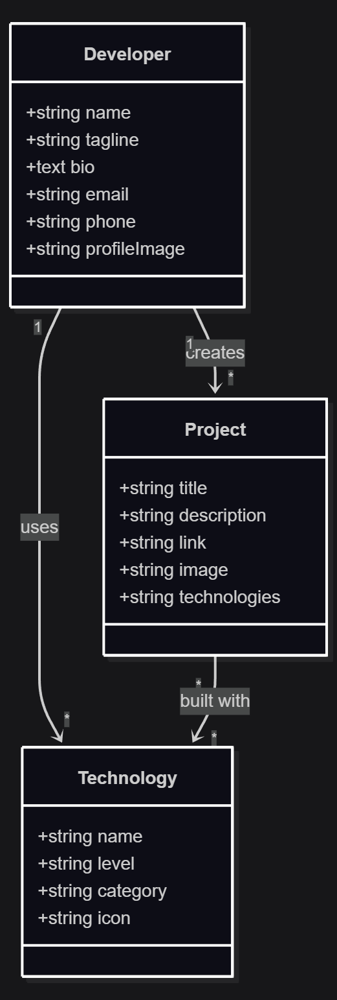
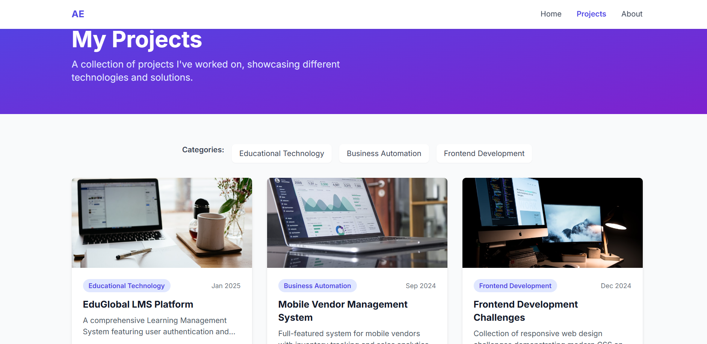

<!-- Title Slide -->
<!-- Add "class: title-slide" for custom style -->
<!-- Use class annotation in Marp -->

<!-- _class: title-slide -->

# **Portfolio Website**
### Présentation de l'analyse et de la planification

**Presented by:** Essamrachi Ali  
**Cliente:** Aymane El Achiri  
**Date:** 13-10-2025

---

# **Besoins & Pages principales**

### Objectifs :
- Créer un site portfolio personnel pour se présenter aux RH.  
- Mettre en valeur les compétences et les réalisations.  
- Fournir un aperçu clair du profil professionnel.  
- Permettre un contact rapide et simple.  
- Donner une image moderne et professionnelle.  

---

### **Pages principales :**
- **Accueil :** Photo, présentation rapide, bouton “Contactez-moi”.  
- **Projets :** Liste des projets avec descriptions, images et technologies utilisées.  
- **Contact :** Formulaire ou lien direct vers email / LinkedIn.  

---

# **Exemple de l’existant**

---

# **Diagramme du cas d’utilisation (PlantUML)**

---

# **Diagramme de class**

---

# **Conception : Navigation Flow**

---

# **Conception : Prototype**

---

---

